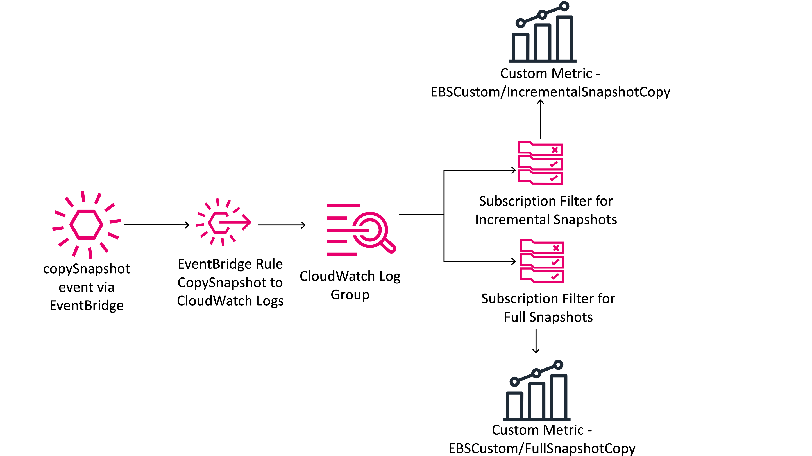

## EBS Snapshot Copy Monitor

This CloudFormation template deploys CloudWatch Event rules, CloudWatch Log Groups and CloudWatch Log Group metric filters to create custom metrics that indicate the number of EBS Snapshot copies that are incremental vs full. These metrics can be helpful in monitoring whether snapshots are being made incrementally as expected or not, this can be especially helpful in managing data transfer costs for cross-region EBS Snapshot copies.

Important note: This solution must be deployed in the destination AWS Region to monitor copySnapshot operations that are cross region. Deploying this solution in the source region will not capture the necessary copySnapshot CloudWatch Event.

## Architecture:

## Launching the CloudFormation stack:

To begin, launch the CloudFormation stack.  

1.  Go to AWS CloudFormation in the AWS Management Console.  
  
2.  Choose Create Stack and select “With new resources” (standard).  

3.   On the Create Stack page, under Specify template, select the Upload a template file template source.  

4.  Select Choose file and find the template that you downloaded in the Prerequisites steps.  

5.  Choose Next to continue.  

6.  On the Specify Stack Details page, give your stack a name, such as “MyStackName”.  

7.  Under Parameters, review the default parameters and update them as needed. All parameters are either optional or default to a usable value.

Optionally configurable parameters are:

LogGroupKMSKey - Define the KMS Key ARN that you would like to use to encrypt the CloudWatch log group. Not defining a KMS key ARN uses the default CloudWatch logs Server Side Encryption (SSE). If using KMS, refer to the documentation for the proper key policy: https://docs.aws.amazon.com/AmazonCloudWatch/latest/logs/encrypt-log-data-kms.html

LogGroupName - The name of the CloudWatch Logs Log Group name - defaults to EBS-copySnapshot

LogGroupRetentionDays - The number of days to retain CloudWatch Logs. This parameter defaults to 30 days, but can be configured as low as 1 day. Longer retention periods may be desired to assist in investigating the cause of full snapshot copies.

MetricNamespace - The CloudWatch Metrics namespace where custom metrics are published. Defaults to ebs-custom/CopySnapshot.

## Security

See [CONTRIBUTING](CONTRIBUTING.md#security-issue-notifications) for more information.

## License

This library is licensed under the MIT-0 License. See the LICENSE file.

